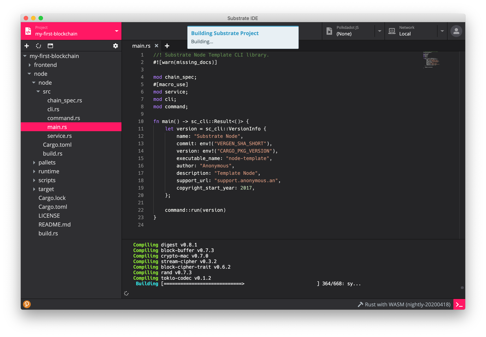
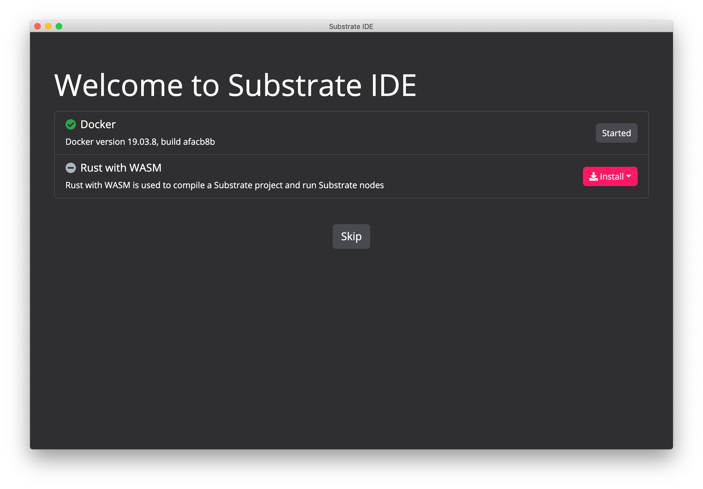
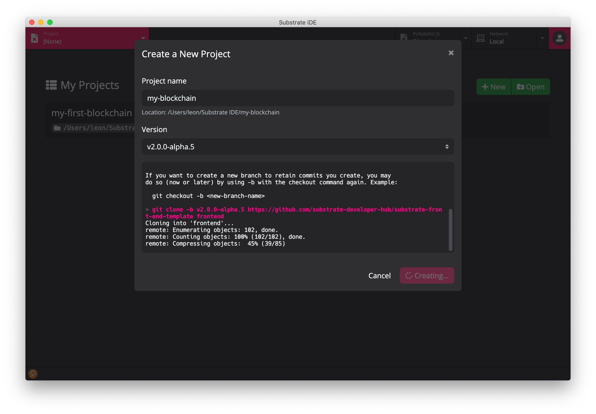
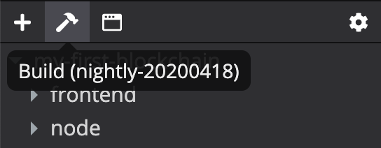
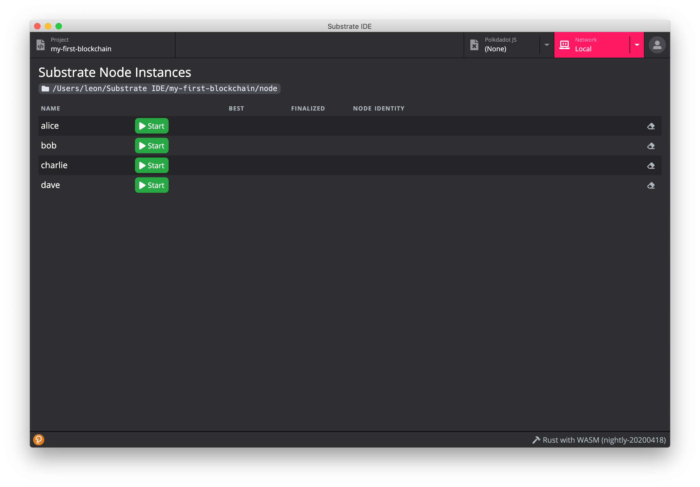
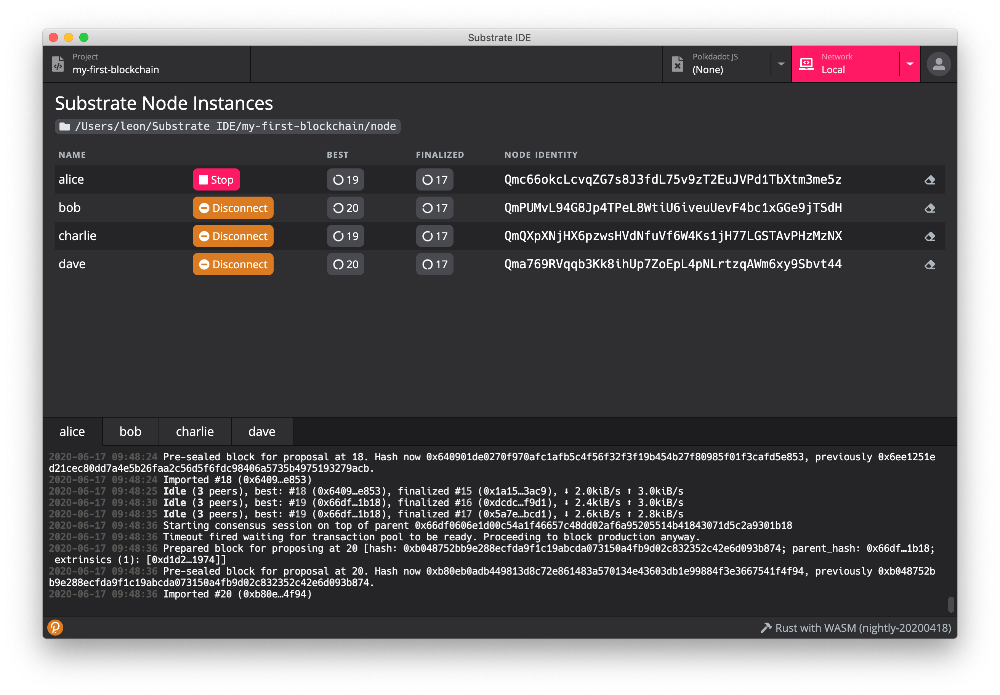
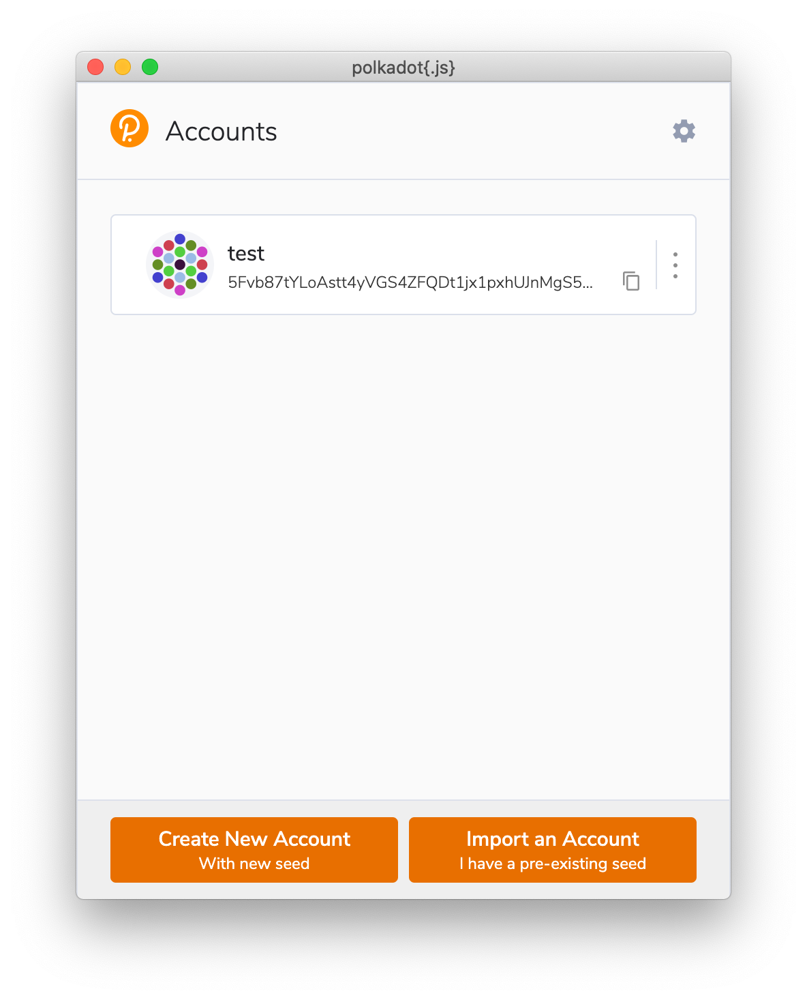
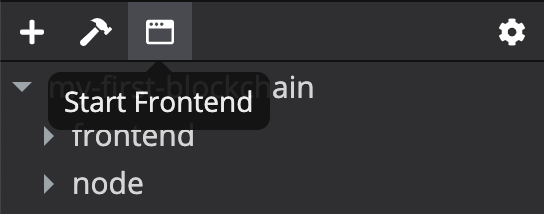
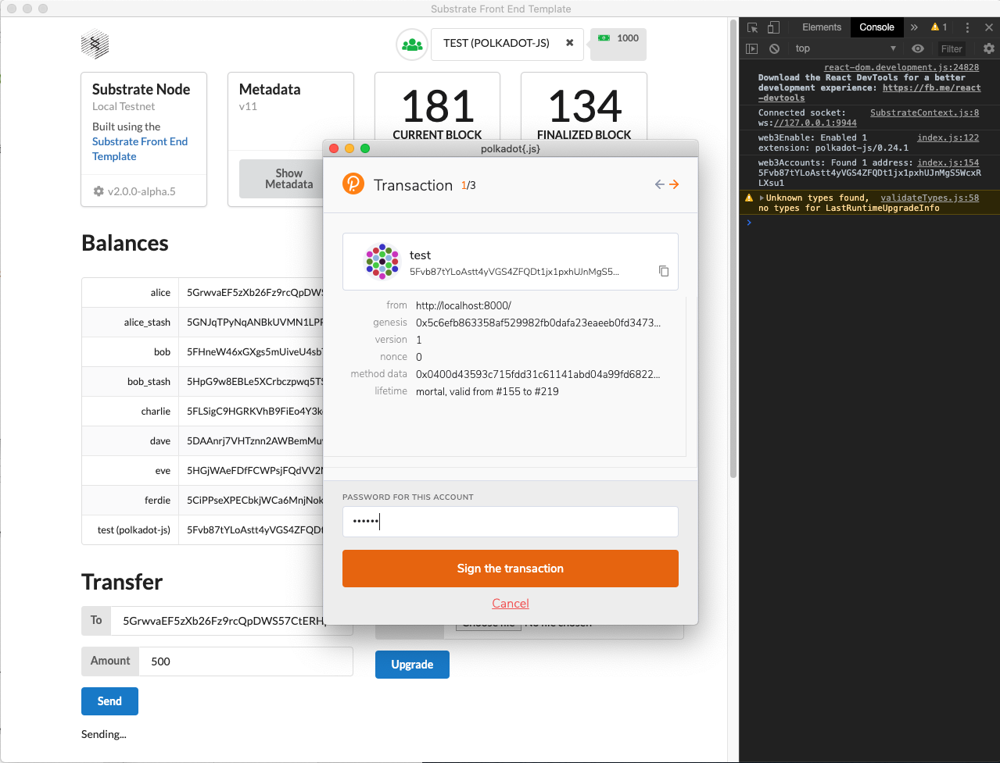
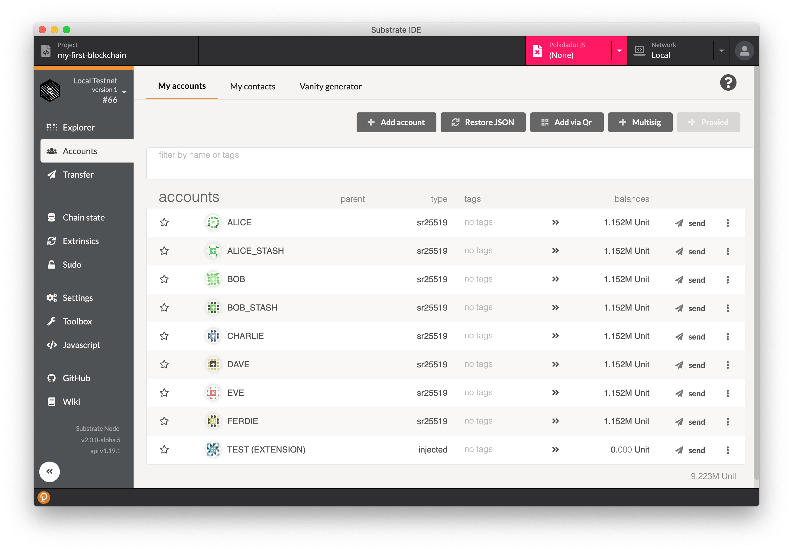

# Substrate IDE

Substrate IDE can help developers quickly build [Substrate](https://substrate.dev/)-based blockchains. It provides tools required for both blockchain and frontend development. The integrated [polkadot.js explorer](https://github.com/polkadot-js/apps) and [polkadot{.js} extension](https://github.com/polkadot-js/extension) make interaction with Substrate nodes very easy.

## Installation

### Download

Installation packages are provided in [releases](https://github.com/ObsidianLabs/SubstrateIDE/releases). Please select the appropriate format according to your operating system (`.dmg` or `.zip` for Mac OS, `.AppImage` for Linux).

### Install

- **MacOS**: Double-click to open `SubstrateIDE-x.x.x.dmg` and drag *Substrate IDE* into the *Applications* folder.
- **Linux**: Right-click `SubstrateIDE-x.x.x.AppImage`, select *Properties* => *Permissions* => *Execute*, and check the option *Allow executing file as progrom*. Close the property window and double-click the application to open it (different Linux systems may have slightly different installation procedures).

## Feature Walkthrough

### Prerequisites

When Substrate IDE is properly installed and started for the first time, it will display a welcome page to help you install the dependencies for substrate development - *Docker* and *Rust with WASM*.

  

- Substrte IDE uses [Docker](https://www.docker.com/) to run substrate node and the compiler. If you don't have Docker installed before, click the Install Docker button to open the Docker official website and follow the instructions to download and install.
- [Rust with WASM](https://hub.docker.com/r/obsidians/rust-w-wasm) is a pre-built docker image for nightly Rust and WASM. Click the *Install* button, select the latest version, and a popup window will show up to download the docker image.

After all dependencies are installed, the gray *Skip* button will change to a red *Get Started* button. You can click it and enter the main interface of Substrte IDE.

### Create a Project

The main interface will show a list of substrate projects. If you open Substrate IDE for the first time, this list will be empty.

Click the *New* button to open the *Create a New Project* popup window. Type the project name, select the appropriate version, and click the *Create Project* button. Substrate IDE will download templates for both the substrate node and the frontend, and install required dependencies. Wait until the project is properly initialized.

  

After a project is created, Substrate IDE will automatically navigate to the project editor.

### Build the Project

Click the *Build* button (with the hammer icon) in the project toolbar (above the file tree) to compile the current substrate project.

  

To compile a substrate node may take a long time, especially for the first time. Depending on your machine configuration, the compilation time may vary from half an hour to two hours.

  

The compiled node executable will be at `./node/target/release/node-template`

### Start Node

After the node executable is compiled, click the *Network* tab in the header to open the Substrate network manager, where you can start the node.

  

Click one of the *Start* button to start a node as the main node. The terminal below will display its logs. After the main node is started, you can click *Join* buttons to add other nodes to the network. Every time you start a node, a new log terminal will be opened so that you can view logs of each node separately.

  

### Keypair Manager: polkadot{.js}

Click the orange button in the bottom left corner to open the *polkadot{.js}* keypair manager. If you open it for the first time, you may need to grant the permission for Substrate IDE to access the keypairs.

  

In the keypair manager, you can create, modify, and delete substrate keys. It is also responsible for signing transactions constructed by Substrate IDE. When a signature is required, the keypair popup window will display again and ask for signing.

For more info, please refer to: https://github.com/polkadot-js/extension

### Start the Frontend

When the network is started, switch back to the project editor and click the third button in the toolbar to start the frontend. Substrate IDE will start the frontend project in a new window where you can interact with the running blockchain.

  

The frontend is based on the [substrate frontend template](https://github.com/substrate-developer-hub/substrate-front-end-template). When it is started Substrate IDE will inject the `polkadot{.js}` keypair manager so that you can use it to create and sign transactions.

  

### Polkadot JS Explorer

Substrate IDE also comes with the [Polkadot JS](https://github.com/polkadot-js/apps) explorer which you can open it through the *Polkadot JS* tab in the header. It will also connect the *polkadot{.js}* keypair manager and ask for permissions to access the keypairs. After the authorization is granted, you will be able to use the explorer to access on-chain data or submit transactions.

  

For more info, please refer to: https://github.com/polkadot-js/apps