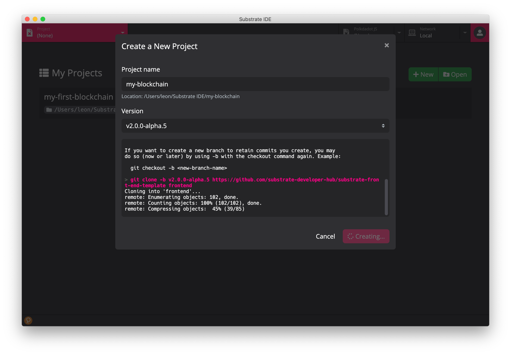

# Substrate IDE documentation

## Documentation

### Overview

Substrate IDE can help developers quickly build Substrate-based blockchains. It provides tools required for both blockchain and frontend development. The integrated polkadot.js explorer and polkadot{.js} extension make interaction with Substrate nodes very easy.

### Dependency
Docker and Rust with WASM are required byto run normally. After starting Substrate IDE for the first time, you will be prompted to install and start these two dependencies on the welcome page.

### Project list
The project list displays the created or opened projects, and consists of the project list, the create project button, and the open project button.

#### Create a project
Click the `New` button to create a new project. The new project will download the template and open the project after completion.

#### Open the project
Click the `Open` button to open the created project.

### Project Editor
The project editor is where Substrate IDE edits the project. It is mainly composed of a code editor, a file tree, a toolbar, and a terminal.

#### Code Editor
The code editor integrates commonly used code editing functions, such as highlighting, auto-completion in Rust, JS and other languages, searching, counting the number of lines and other functions.

#### File tree
The file tree manages project files and folders, including the functions of adding/modifying/deleting files/folders and opening files.

#### Terminal
The terminal mainly displays logs of project compilation and startup of the front-end development environment.

#### toolbar
The toolbar is composed of 4 buttons, including a new file/folder button, a compile button, a front-end development environment start button, and a project settings button

##### Compile button
The compile button can start compilation and terminate compilation.

##### Front-end development environment start button
The front-end development environment start button can start the front-end environment and terminate the environment.

##### Project settings button
The project settings button will open the project settings page.

### Network Manager
The network manager contains a list of nodes and a log monitor.

#### Node list
The node list of the current project is displayed, and the node can be started, the node joins the network and the node data is cleared.

#### Log Monitor
Display the log after the node is started. When multiple nodes are started at the same time, you can view different node information through label switching.

### Key pair management
Users can create, modify, delete keys, and construct transaction signatures for the IDE through the key pair manager.

Please refer to: https://github.com/polkadot-js/extension

### Polkadot JS Explorer
Through Polkadot JS Explorer users can view on-chain data, construct transactions and other functions.

Please refer to: https://polkadot.js.org/apps/#/explorer

## Quick start

### Installation

#### Download
Download address: https://github.com/ObsidianLabs/SubstrateIDE/releases

Please download files according to the system, download `.dmg` file for `macOS` and download `.AppImage` file for `Linux`

#### Installation

##### MacOS
Double-click to open `SubstrateIDE-0.1.1.dmg` and drag `SubstrateIDE` into the `Application` folder

#### Linux
(Taking Ubuntu 18.04 as an example, different Linux systems may have slightly different installation methods)
Right-click `SubstrateIDE-0.1.1.AppImage`, select `Properties` => `Permissions` => `Execute`, check `Allow executing file as progrom`, close this window and double-click to open the application

### Ready to work
After the Substrate IDE is properly installed and started for the first time, the Substrate IDE displays a welcome page.

After starting Substrate IDE, the welcome page shows two dependencies - Docker and Rust.

- Docker: If Docker is not installed, you can install it through the `Install Docker` button; if Docker is not started, you can start it through the `Start Docker` button.
- Rust with WASM: After starting Docker, click `Install` and select the required version in the drop-down menu, such as `nightly-20200418`. After clicking it, a download window will pop up, waiting patiently for download.

After downloading and starting the two dependencies, the gray `Skip` button will be changed to the red `Get Started` button, and click to enter the main interface of Substrate IDE.

### Create a project
After entering the main interface, the first thing you see is the `My Projects` project list. If you open it for the first time, this list is empty.

Click the `New` button to pop up the Create Project window, type the project name in `Project name` field, and select the appropriate version in the `Version` drop-down menu, click the `Create Project` button, Substrate IDE will start downloading the template, wait until the creation of the project is done.

After the project is created, it will automatically open the project and switch to the project editor.

### Build the project
Click the second button (hammer-shaped Build button) in the toolbar above the file tree, and Substrate IDE will start compiling the current project.

*Compiling a project is time-consuming. Depending on the computer configuration, the compilation time may vary from half an hour to two hours.

### Start Node
After compiling the project, you can start a node.

Click the `Network` tab at the top of Substrate IDE, and the main page will switch to the node management page.

Select one of the nodes and click the `Start` button to start the node, and the log monitor will show up below. After starting a node, click the `Join` button on the remaining nodes to add these nodes to the network. Every time you start and join a node, a new log monitor below will be opened. You can click on different tabs to view the logs of each node.

### Manage keypairs
Click the orange button in the bottom left corner, the `polkadot{.js}` keypair manager will pop up, click `Yes, allow this application access` to complete the authorization.

Users can create, modify, and delete keys through the keypair manager. At the same time, the manager is also responsible for signing the transactions constructed by Substrate IDE. When a signature is required, the manager will pop up the signature window.

For more info, please refer to: https://github.com/polkadot-js/extension

### Start a front-end development
The front-end development depends on the startup of the node. When a node starts correctly, switch back to the project editor page and click the third button (Start Frontend button) in the toolbar above the file tree. Substrate IDE will start the front-end development.

The started front-end development is based on the Substrate Frontend template: https://github.com/substrate-developer-hub/substrate-front-end-template

Users can use the launched front-end development to create transactions, and use the keys in keypair manager to sign the transaction:

[TBD]

[Picture]

### Polkadot JS Explorer
After the node is started, click the `Polkadot JS` tab at the top of the Substrate IDE, the page will be switched to the block data browser, and the `polkadot{.js}` window will pop up to request authorization. After authorizing by clicking `Yes, allow this application access`, the block data browser will be displayed and the user can check the data on the current chain.

Through Polkadot JS Explorer users can view the data on the chain and create transactions. For more info, please refer to: https://polkadot.js.org/apps/#/explorer