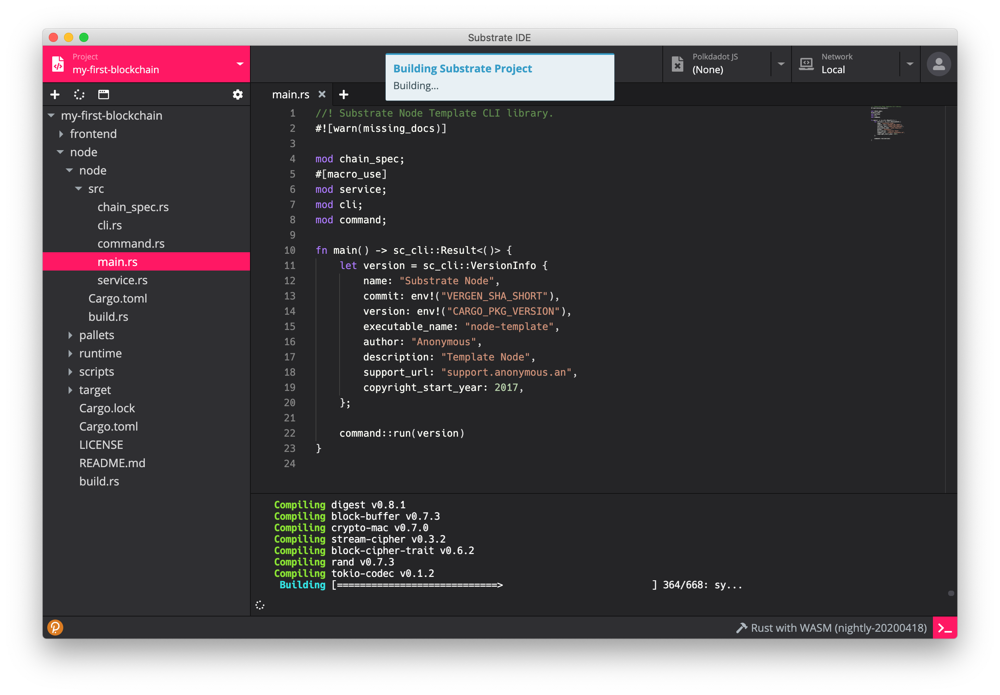
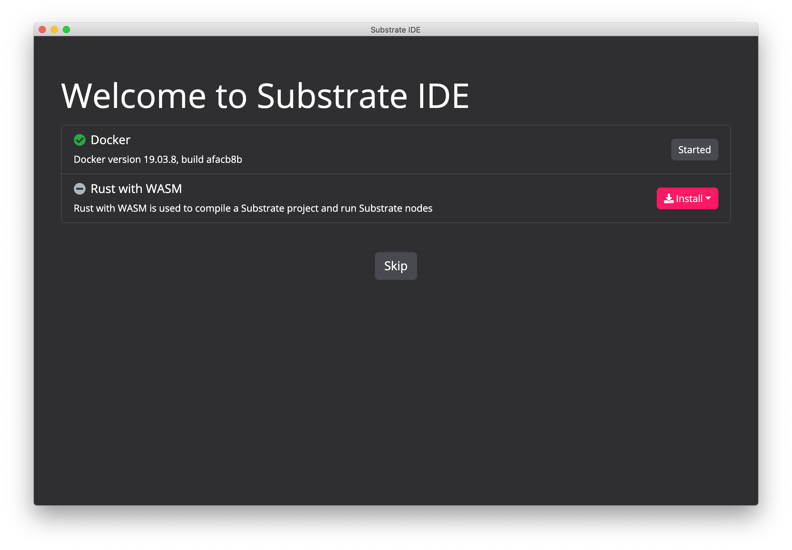
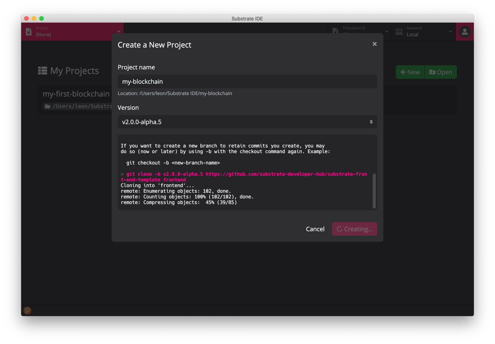
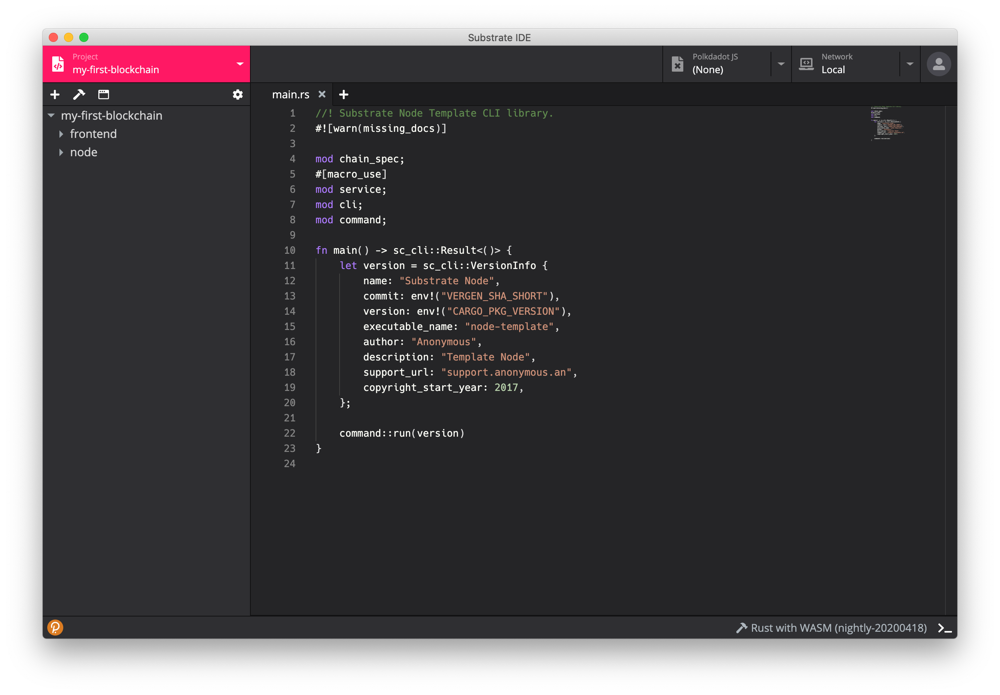
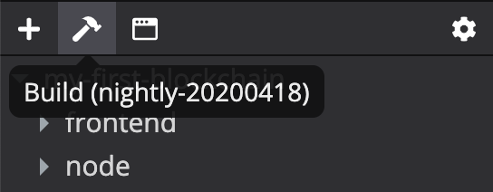
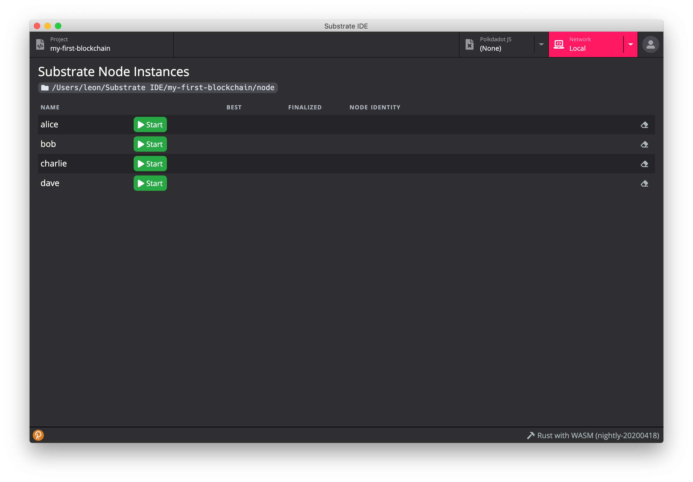
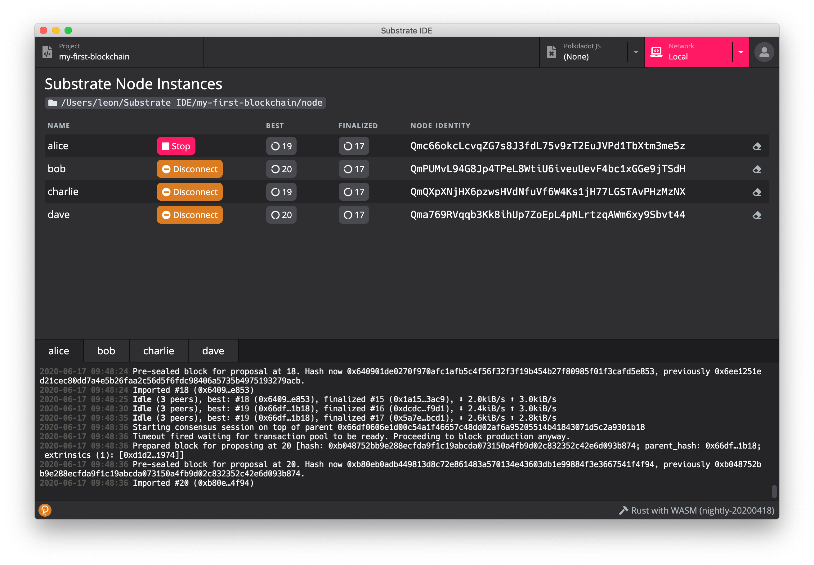
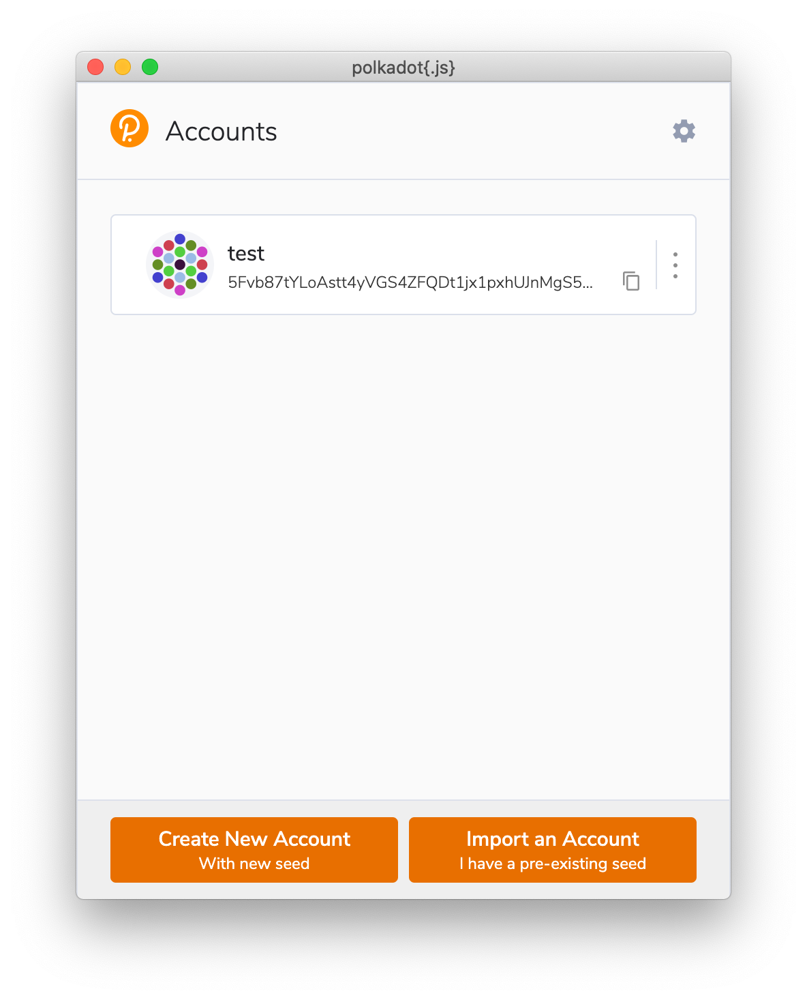
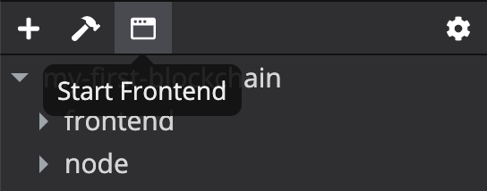
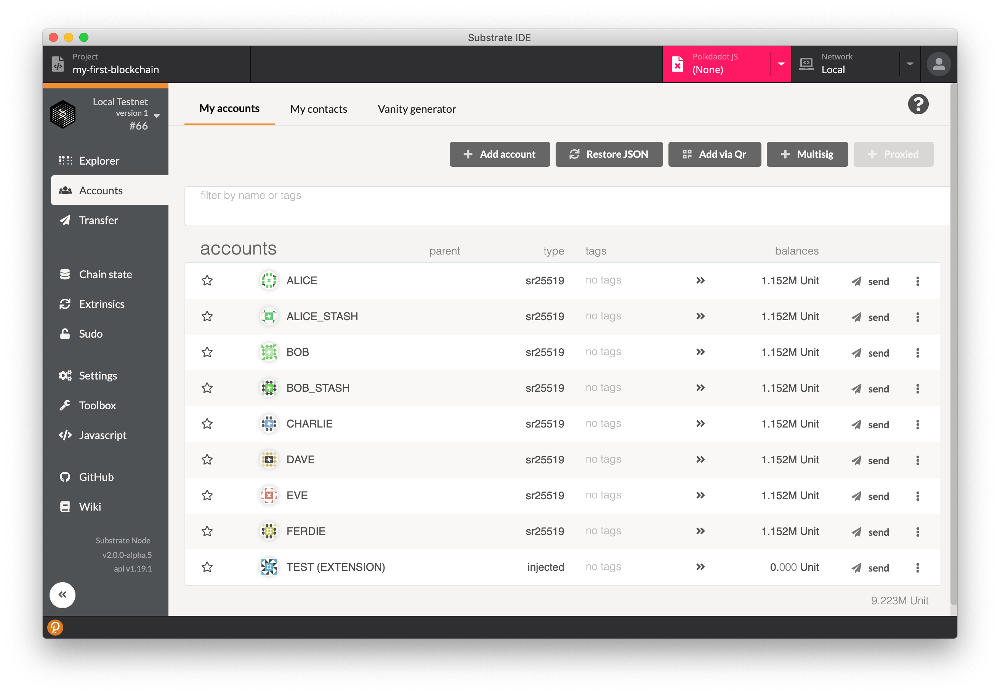

# Substrate IDE 文档

## 文档

### 概览

Substrate IDE can help developers quickly build Substrate-based blockchains. It provides tools required for both blockchain and frontend development. The integrated polkadot.js explorer and polkadot{.js} extension make interaction with Substrate nodes very easy.

### 依赖
Substrate IDE 需要依赖 Docker 以及 Rust with WASM 以正常运行，第一次启动 Substrate IDE 后将会在欢迎页面提示安装和启动这两个依赖。

### 项目列表
项目列表显示所创建过或者打开过的项目，由项目列表、创建项目按钮和打开项目按钮组成。

#### 创建项目
点击 `New` 按钮可以新建项目，新建项目将会下载模版并在完成后打开项目。

#### 打开项目
点击 `Open` 按钮可以打开已经创建好的项目。

### 项目编辑器
项目编辑器是 Substrate IDE 编辑项目的地方，主要由代码编辑器、文件树、工具栏、终端组成。

#### 代码编辑器
代码编辑器集成了常用的代码编辑功能，如高亮、Rust 和 JS 等语言的自动补全、搜索、统计行数等功能。

#### 文件树
文件树管理项目文件及文件夹的，包括文件/文件夹的新增、修改、删除，文件的打开等功能。

#### 终端
终端主要显示项目编译和前端开发环境启动的日志。

#### 工具栏
工具栏由4个按钮组成，包括了新建文件/文件夹按钮、编译按钮、前端开发环境启动按钮和项目设置按钮

##### 编译按钮
编译按钮可以启动编译以及终止编译。

##### 前端开发环境启动按钮
前端开发环境启动按钮可以启动前端环境以及终止环境。

##### 项目设置按钮
项目设置按钮将会打开项目设置页面。

### 网络管理器
网络管理器包含了节点列表以及日志监控器。

#### 节点列表
显示当前项目的节点列表，并可以启动节点、节点加入网络及清除节点数据。

#### 日志监测器
显示节点启动后的日志，当有多个节点同时启动时，可通过标签切换查看不同的节点信息。

### 密钥对管理
用户可以通过密钥对管理器创建、修改、删除密钥、为 IDE 构造交易签名。

请参考：https://github.com/polkadot-js/extension

### Polkadot JS Explorer
通过 Polkadot JS Explorer 用户可以查看链上数据，构造交易等功能。

请参考：https://polkadot.js.org/apps/#/explorer

## 快速上手

### 安装

#### 下载
下载地址：https://github.com/ObsidianLabs/SubstrateIDE/releases

请根据系统下载文件，如 `macOS` 下载 `.dmg` 文件，`Linux` 下载 `.AppImage` 文件

#### 安装

##### MacOS
双击打开 `SubstrateIDE-0.1.1.dmg`，并将 `SubstrateIDE` 拖进 `Application` 文件夹

#### Linux
(以 Ubuntu 18.04 为例，不同版本 Linux 系统可能安装方式略有不同)
右键点击 `SubstrateIDE-0.1.1.AppImage`，选择 `Properties` => `Permissions` => `Execute`，将 `Allow executing file as progrom` 勾选上，关闭此窗口并双击打开应用

### 准备工作
正确安装并第一次启动 Substrate IDE 后，Substrate IDE 会显示欢迎页面。

欢迎页面显示两项运行 Substrate IDE 的依赖 Docker 和 Rust。

- Docker: 如果没有安装 Docker，可以通过 `Install Docker` 按钮进行安装；如果没有启动 Docker，可以通过 `Start Docker` 启动。
- Rust with WASM: 在正确启动 Docker 后，点击 `Install` 并在弹出的下拉菜单选择需要的版本，如 `nightly-20200418`，点击后将会弹出下载窗口，耐心等待下载。

完成了两个依赖的下载及启动后，灰色的 `Skip` 按钮将变成红色的 `Get Started` 按钮，点击进入 Substrate IDE 主界面。

### 创建项目
在进入主界面后，首先看到的是 `My Projects` 项目列表，如果是第一次打开，这个列表为空。

点击 `New` 按钮，弹出创建项目窗口，在 `Project name` 中输出项目名称，并在 `Version` 下拉框选择合适的版本，点击 `Create Project` 按钮，Substrate IDE 将会下载模版，稍等片刻完成项目的创建。

项目创建完成后将会自动打开项目并跳转至项目编辑器。

### 编译项目
点击文件浏览上方工具栏的第二个按钮 (锤子形状的 Build 按钮)，Substrate IDE 将开始编译当前项目。

*编译项目较为耗时，根据计算机配置的不同，编译时长半小时到两小时不等。

### 启动节点
完成项目的编译后，便可以启动节点了。

点击 Substrate IDE 顶部的 `Network` 标签，主页面将切换至节点管理页面。

选择其中一个节点并点击 `Start` 按钮将启动节点，同时下方将弹出节点日志监控。在启动一个节点后，点击其余节点的 `Join` 按钮会将节点加入到网络中。每启动一个节点，下方日志监控将会打开一个新的标签，可以通过点击不同的标签来查看各节点的日志。

### 管理密钥对
点击左下角的橙色按钮，将会弹出 `polkadot{.js}` 密钥对管理器，点击 `Yes, allow this application access` 完成授权。

用户可以通过密钥对管理器创建、修改、删除密钥。同时管理器还负责为 IDE 构造的交易做签名，当需要签名的时候，管理器会弹出签名请求弹窗。

具体使用方法可参考：https://github.com/polkadot-js/extension

### 启动前端开发环境
前端开发环境需要依赖节点的启动。当节点正确启动后，切回项目编辑器页面，点击文件浏览上方工具栏的第三个按钮 (Start Frontend 按钮)，Substrate IDE 将启动前端开发环境。

启动起来的前端开发环境是基于 Substrate Frontend 的模版：https://github.com/substrate-developer-hub/substrate-front-end-template

用户可以使用启动起来的前端开发环境进行交易，使用密钥对管理器进行交易签名：

[TBD]

[图]

### Polkadot JS Explorer
节点启动后，点击 Substrate IDE 顶部的 `Polkadot JS` 标签，页面将切换至区块数据浏览器，同时将弹出 `polkadot{.js}` 窗口请求授权。点击 `Yes, allow this application access` 完成授权后，区块数据浏览器将显示当前链上的数据。

通过 Polkadot JS Explorer 用户可以查看链上数据，构造交易，具体使用方法可参考：https://polkadot.js.org/apps/#/explorer
